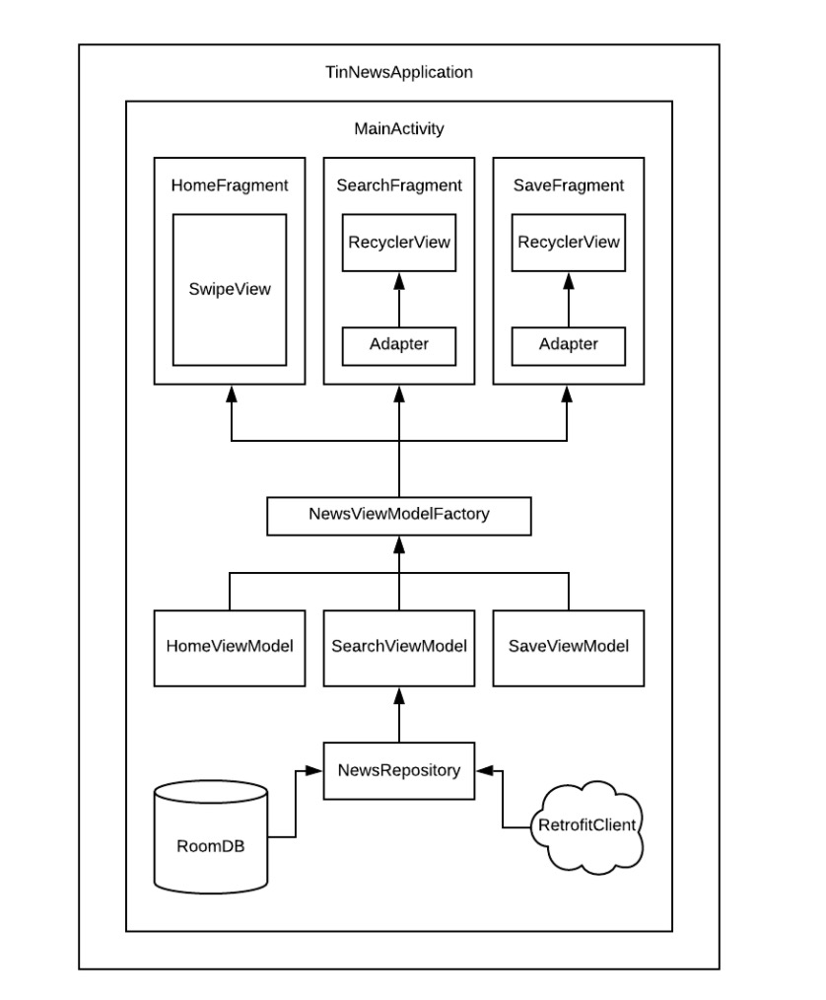

# newsApp 
This news app based on Google component MVVM pattern. 
Utilized Mindorks’s PlaceHolderView to support swipe gestures for liking/disliking the news. 
Built the Room Database with LiveData & ViewModel to support local cache and offline model. 
Integrated Retrofit and Rxjava to pull the latest news data from a RESTFUL endpoint  (newsapi.org) .

The whole view of this news application is below:

The architecture of this application is below:

